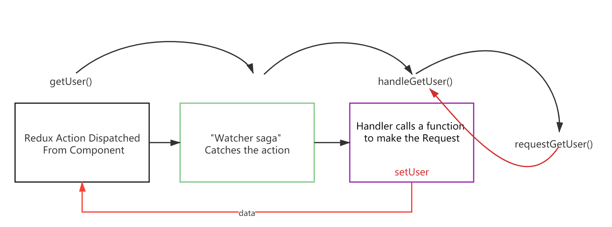

ReduxSaga 学习笔记

Reference: [video source](https://www.youtube.com/watch?v=1K26DIKt3w8)

code: [youtuber's code](https://codesandbox.io/s/redux-saga-stoic-euler-cjhgx-forked-utkhw?file=/src/redux/ducks/user.js:176-180)

myCode: [github repo](https://github.com/zzusunjs/helloreduxsaga)

Reudx-Saga 的工作流程如上图所示，首先是 React 组件 dispatch 一个 action ，然后这个 action 被 Watcher Saga 捕获，Watch Saga 接着调用 Reducer 函数，Reducer 函数调用 requestGetUser( ) 异步获取数据并通过setUser( ) 将请求到的数据更新到 Redux store 中，至此，所有的 React 组件都可以访问请求到的数据了。

详情可以查看 [这里](https://github.com/zzusunjs/helloreduxsaga) 的代码，从 useEffec 中的 dispatch，到 saga 中间件捕获 action，触发 handleGetUser，然后调用 requestGetUser 发起 GET 请求，最后 handlerGetUser 发起 setUser action，触发 userReducer，将请求到的数据更新到 Redux Store 中。

modified